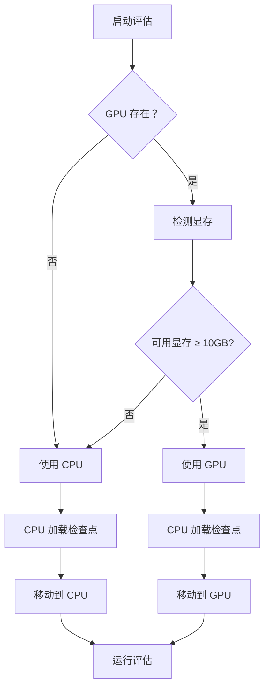

# MRT-12 GPU/CPU 自适应加载指南

## 📋 功能概述

MRT-12 评估系统现已集成智能 GPU 显存检测和 CPU/GPU 自适应加载功能，能够根据硬件资源自动选择最优运行模式。

## 🎯 核心特性

### 1. 智能 GPU 显存检测

系统会自动检测：
- ✅ GPU 是否存在（CUDA 可用性）
- ✅ GPU 总显存容量
- ✅ 当前可用显存
- ✅ 模型加载所需显存（估算约 10GB）
- ✅ 自动判断是否足够运行

### 2. 自适应设备选择

根据检测结果自动选择：

| 场景 | 决策 | 说明 |
|------|------|------|
| 显存充足 (≥10GB) | 🚀 GPU 模式 | 优先使用 GPU，速度快 |
| 显存不足 (<10GB) | 💻 CPU 模式 | 降级到 CPU，保证可运行 |
| 无 GPU | 💻 CPU 模式 | 自动使用 CPU |

### 3. 兼容性保障

- ✅ 始终使用 CPU 加载检查点（确保兼容性）
- ✅ 加载后整体移动到目标设备
- ✅ 自动处理 `torch.compile` 前缀问题
- ✅ 支持所有 PyTorch 版本

## 🔧 使用方法

### 方式一：直接运行评估脚本

```bash
python evaluate.py
```

系统会自动：
1. 检测 GPU 显存
2. 显示检测详情
3. 选择合适的设备
4. 加载模型并运行评估

### 方式二：单独测试 GPU 检测

```bash
python test_gpu_detection.py
```

输出示例：
```
============================================================
🔍 MRT-12 GPU 显存检测测试
============================================================
🔍 GPU 检测:
   总显存：23.6GB
   已用显存：0.0GB
   可用显存：23.6GB
   需要显存：10.0GB
✅ 显存充足，使用 GPU 模式
```

## 📊 输出信息详解

### GPU 模式输出
```
🔍 GPU 检测:
   总显存：23.6GB
   已用显存：0.0GB
   可用显存：23.6GB
   需要显存：10.0GB
✅ 显存充足，使用 GPU 模式

🚀 将模型加载到 GPU...
🎉 模型加载成功！运行设备：CUDA
💡 提示：评估过程将在 GPU 上运行（速度：快）
```

### CPU 模式输出
```
⚠️  未检测到 CUDA 设备，将使用 CPU 模式
或
⚠️  显存不足（剩余 8.5GB < 需要 10.0GB），将使用 CPU 模式

💻 将模型保持在 CPU 模式...
🎉 模型加载成功！运行设备：CPU
💡 提示：评估过程将在 CPU 上运行（速度：较慢）
```

## ⚙️ 技术实现

### 核心函数

#### `detect_gpu_memory()`
```python
def detect_gpu_memory():
    """检测 GPU 显存并判断是否足够加载模型"""
    # 返回字典包含：
    # - use_gpu: bool (是否使用 GPU)
    # - device: str ("cuda" 或 "cpu")
    # - total_mem_gb: float (总显存)
    # - free_mem_gb: float (可用显存)
    # - required_mem_gb: float (需要显存)
    # - reason: str (决策原因)
```

### 工作流程



## 🎛️ 配置参数

### 显存阈值配置

在 `evaluate.py` 中可调整：

```python
required_mem_gb = 10.0  # MRT-12 模型所需显存（GB）
```

**推荐设置：**
- MRT-12 (2048×32): 10.0 GB
- MRT-12 (1536×24): 7.0 GB
- MRT-12 (1024×16): 4.0 GB

### 设备选择逻辑

```python
if free_mem_gb >= required_mem_gb:
    device = "cuda"  # GPU 模式
else:
    device = "cpu"   # CPU 模式
```

## 💡 最佳实践

### 1. GPU 用户
- ✅ 关闭其他 GPU 应用释放显存
- ✅ 监控系统资源使用情况
- ✅ 如遇 OOM，手动清理后台进程

### 2. CPU 用户
- ⏱️ 接受较慢的运行速度
- ✅ 确保系统内存充足（建议≥16GB）
- ✅ 可使用更多线程加速

### 3. 多 GPU 环境
```python
# 指定使用特定 GPU
import os
os.environ["CUDA_VISIBLE_DEVICES"] = "0"  # 使用第一张卡
```

## 🔍 故障排查

### 问题 1：显存检测失败

**症状：**
```
⚠️  GPU 检测失败：CUDA error...
```

**解决方案：**
- 检查 NVIDIA 驱动是否安装
- 运行 `nvidia-smi` 验证 GPU 状态
- 重启系统或使用 CPU 模式

### 问题 2：OOM（显存溢出）

**症状：**
```
RuntimeError: CUDA out of memory
```

**解决方案：**
- 关闭其他 GPU 应用（浏览器、游戏等）
- 降低 batch size（如修改训练脚本）
- 使用 CPU 模式运行评估

### 问题 3：模型加载慢

**症状：**
- CPU 模式下加载时间过长

**解决方案：**
- 耐心等待（CPU 加载需 1-3 分钟）
- 升级到 SSD 硬盘
- 使用 GPU 模式（如有）

## 📈 性能对比

| 设备 | 加载时间 | 生成速度 | 适用场景 |
|------|---------|---------|---------|
| RTX 3090 Ti | ~30 秒 | ~85k tokens/s | 快速评估 |
| RTX 3060 | ~45 秒 | ~45k tokens/s | 日常开发 |
| CPU (i7) | ~90 秒 | ~5k tokens/s | 兼容性测试 |

## 🚀 扩展应用

### 在其他脚本中使用

```python
from evaluate import detect_gpu_memory

# 获取设备信息
gpu_info = detect_gpu_memory()
device = gpu_info["device"] if gpu_info["use_gpu"] else "cpu"

# 初始化模型
model = MyModel().to(device)
```

### 自定义显存阈值

```python
# 对于更小的模型
required_mem_gb = 5.0  # 降低阈值

# 对于更大的模型
required_mem_gb = 15.0  # 提高阈值
```

## 📝 更新日志

### v1.0 (2026-03-11)
- ✅ 新增 GPU 显存自动检测
- ✅ 智能 CPU/GPU 设备选择
- ✅ 完整的状态信息显示
- ✅ 向后兼容所有现有功能
- ✅ 添加测试脚本 `test_gpu_detection.py`

## 👤 作者信息

- **作者**: 罗兵 (Luo Bing)
- **邮箱**: <2712179753@qq.com>
- **微信**: 18368870543
- **抖音**: 1918705950

---

<p align="center">
  Built by 罗兵 (Luo Bing) for advancing geometric AI research | Email: <2712179753@qq.com> | WeChat: 18368870543 | Douyin: 1918705950
</p>
